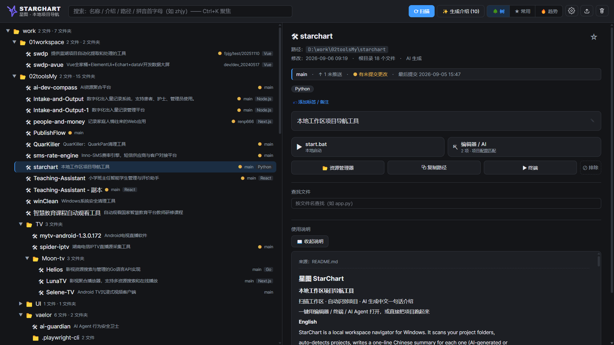
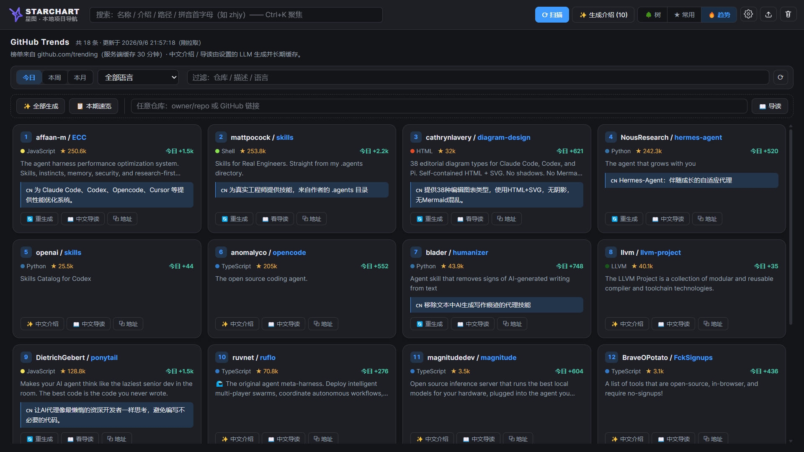

<div align="center">


# 星图 StarChart

**本地工作区项目导航工具**

扫描工作区 · 自动识别项目 · AI 生成中文一句话介绍
一键用编辑器 / 终端 / AI Agent 打开，或直接把项目跑起来


</div>

<details>
<summary><b>English</b></summary>

StarChart is a local workspace navigator for Windows. It scans your project folders,
auto-detects projects, writes a one-line Chinese summary for each one (AI-generated or
extracted from its README), and lets you open any project in your editor, terminal or AI
coding agent — or simply run it — in a single click.

Built on the Python standard library only. All data stays on your machine; the HTTP
service listens on `127.0.0.1` only.

Note: the interface and the generated summaries are in Chinese.

</details>

## 目录

- [为什么做这个](#为什么做这个)
- [界面预览](#界面预览)
- [功能特性](#功能特性)
- [快速开始](#快速开始)
- [平台与环境要求](#平台与环境要求)
- [配置 AI 介绍生成](#配置-ai-介绍生成)
- [数据存放位置](#数据存放位置)
- [常见问题](#常见问题)
- [目录结构](#目录结构)
- [安全说明](#安全说明)
- [许可证](#许可证)

## 为什么做这个

工作区里的项目越攒越多，几周没碰的那个 `utils-helper-v2` 到底是干什么的？
翻文件夹、翻 README、翻聊天记录——**找项目的成本常常比改项目还高**。

星图把工作区扫成一棵带介绍的树：每个项目一句话说清它是什么，
搜索框按拼音首字母（`zhjy`）就能命中，找到之后一键跳进编辑器、终端或 AI Agent。

## 界面预览




扫描工作区后自动生成项目树：AI 一句话介绍 + 技术栈徽章 + Git 状态；选中项目一键进编辑器 / 终端 / AI Agent，或直接运行。



内置 GitHub 趋势榜，AI 为每个趋势项目生成中文导读。搜索支持拼音首字母：打 `zhjy` 秒中「智慧教育课程自动观看工具」。

## 功能特性

### 找得到

- **项目识别**：按标志物（`.git`、`package.json`、`requirements.txt` 等）自动识别；
  支持手动标记为项目或排除，标记在重新扫描后保留
- **搜索**：名称、介绍、路径、拼音首字母（如 `zhjy`）、标签、备注；
  命中片段高亮，命中项自动展开所在分支，不会被折叠的父目录挡住
- **中文介绍**：AI 生成 / README 静态提取 / 手动编辑三级来源，
  手动编辑过的内容永不被扫描覆盖；批量生成后端 3 路并发，可中途停止
- **收藏 / 标签 / 备注**：★ 收藏、最多 10 个标签、500 字备注，全部可搜索，重扫不丢
- **常用视图**：顶栏一键切换。真实打开 / 启动过的项目按使用频率排序，
  收藏置顶——解决"我最近在弄的那几个"永远最好找的问题
- **技术栈徽章**：扫描时自动推断主语言 / 框架（React / Python / Go…），树上直接可见
- **查找文件**：详情面板内按文件名即时搜索项目内文件（跳过 node_modules 等），
  一键定位所在目录或复制完整路径

### 进得去

- **跳转**：资源管理器、复制路径、终端、已检测到的编辑器（Trae / VS Code / Cursor 等）
- **Agent 编排**：自动探测本机终端 Agent，并按项目内的配置文件证据
  （`CLAUDE.md`、`.cursor`、`AGENTS.md` 等）匹配该用哪一个
- **本地启动**：识别 npm / python / bat / docker compose / make 入口，
  新终端窗口启动并记录 PID，可一键停止；运行状态持久化，服务重启后自动恢复，
  之前启动的项目不会变成孤儿

### 跟得上

- **Git 状态**：分支名、是否有未提交更改、领先 / 落后远程、最后提交时间；
  树上有未提交更改的项目会标一个橙点。未检测到 git 时自动跳过（设置里可关）
- **GitHub 趋势榜**：顶栏 🔥 打开。
  抓取 github.com/trending 官方榜单（服务端缓存 30 分钟），支持今日 / 本周 / 本月 ×
  19 种语言筛选、关键词过滤；配合 LLM 可为榜单项目一键生成**中文一句话介绍**（批量并发、
  可中途停止）与**中文导读**（参考 zread 的内容框架，依据仓库 README 输出五段式：
  是什么 / 核心功能 / 技术架构 / 适用场景 / 上手指南），
  结果长期缓存；「本期速览」让 AI 通读整份榜单输出风向观察；也支持粘贴任意
  `owner/repo` 或 GitHub 链接直接生成导读。每张卡片可复制仓库地址
- **自动扫描**：服务启动后若索引较旧（超过 1 小时）会在后台自动重新扫描，保持最新；
  可在 ⚙ 设置里关闭。旧索引图立即可用，扫描完成前端自动刷新
- **多工作区**：多个扫描根时按根分组显示（根名 + 根路径），可整体折叠收起，
  折叠状态本地记忆
- **已排除项目管理**：顶栏 🗑 打开「已排除的项目」——被藏起来的项目的"回收站"，
  可按名称 / 路径搜索、单个或全部恢复；排除后右下角提示也带「撤销」按钮可快速反悔
- **备份恢复**：导出 `starchart-YYYYMMDD.zip`，恢复前自动生成 `.bak`
- **主题**：暗色 / 亮色 / 跟随系统

## 快速开始

1. 双击 `start.bat` —— 自动检查依赖，以后台方式启动，图标出现在系统托盘
2. 左键托盘图标打开界面；之后随时可按 **Ctrl+Alt+S** 唤起
3. 首次使用点右上角「⟳ 扫描」建立索引
4. 配置 AI（可选）：⚙ 设置 → 模型设置里「＋ 添加模型」选厂商、去推荐区的申请入口
   拿一个免费 Key 填入、点「测试连接」，再回主界面点「✨ 生成介绍」批量生成中文描述
5. 右键托盘图标 →「退出」结束；也可双击 `stop.bat`

托盘常驻模式不留控制台窗口。想看日志或排查启动问题，运行 `start-console.bat`。

不配置 AI 也能用：此时介绍会回落到「README 首行静态提取」。

## 平台与环境要求

- **Windows**（依赖注册表、PowerShell、explorer、taskkill，未适配 macOS / Linux）
- **Python 3.7 及以上**
- 两个可选依赖，缺了都能降级运行：

  | 依赖 | 作用 | 缺失时 |
  |---|---|---|
  | `pypinyin` | 拼音首字母搜索 | 仅失去拼音搜索，其余功能正常 |
  | `pystray` | 系统托盘图标 | 回落无托盘模式，服务与热键照常工作 |

```bash
pip install -r requirements.txt
```

## 配置 AI 介绍生成

设置 → 模型设置，全部在工具内完成，无需改文件：

- **模型条目**：「＋ 添加模型」从厂商模板
  （智谱 / 硅基流动 / 通义千问 / DeepSeek / 自定义 OpenAI 兼容）下拉选择，
  自动带入 API 地址与默认模型名；**单选哪条，哪条生效**
- **API Key**：密码框 + 小眼睛按需查看；保存时经 Windows DPAPI 加密写入 `config.json`，
  界面回显永远是掩码
- **测试连接**：针对每条模型发一条最小请求，实时显示成功 / 失败原因
- **不预置任何 Key**：内置的免费模型推荐区附各家申请入口直达链接，Key 属于你的私人资产

推荐的免费服务（国内直连、OpenAI 兼容，设置页内附申请入口）：

| 服务商 | baseUrl | model |
|---|---|---|
| 智谱 | `https://open.bigmodel.cn/api/paas/v4` | `glm-4-flash` |
| 硅基流动 | `https://api.siliconflow.cn/v1` | `Qwen/Qwen2.5-7B-Instruct` |
| 通义千问 | `https://dashscope.aliyuncs.com/compatible-mode/v1` | `qwen-turbo` |
| DeepSeek | `https://api.deepseek.com` | `deepseek-chat` |

## 数据存放位置

**默认就在工具文件夹内**：`starchart\.starchart\`。

工具是自包含的——**拷走整个 starchart 文件夹，索引、配置、项目介绍就一起搬走了**，
挪动位置不会丢数据。可用环境变量 **`STARCHART_HOME`** 指定到任意位置
（指定时不做自动迁移）。

| 文件 | 说明 |
|---|---|
| `data.json` | 目录树、项目元数据、介绍、手动标记 |
| `config.json` | 扫描根、黑名单、API 配置（Key 已 DPAPI 加密）、编辑器、主题、端口 |
| `server.log` | 服务日志：跳转 / 启动 / 停止等操作记录，超过 1MB 自动轮转 |

`data.json` 是唯一的索引来源，直接拷走也能当备份；
不过建议用界面上的「📤 备份」导出标准 zip，恢复时会自动生成 `.bak`。

> 从 v1.2 之前的版本升级时，首次启动会自动把旧目录
> （如 `d:\work\.starchart\`）的两个 JSON 复制进来，**只复制不删除**，
> 旧目录原样保留，确认新目录数据无误后可自行清理。
>
> 需要注意：数据现在与代码同处一地，**升级工具时请不要删掉 `.starchart\` 目录**
> —— 稳妥做法是先点「📤 备份」导出 zip。

## 常见问题

<details>
<summary><b>启动提示端口被占用</b></summary>

先运行 `stop.bat`；若仍占用，在设置里换端口后重启。

</details>

<details>
<summary><b>拼音搜索没反应</b></summary>

检查 `pypinyin` 是否安装成功（`pip install pypinyin`）。

</details>

<details>
<summary><b>编辑器 / Agent 卡片是灰的</b></summary>

只显示本机探测到的程序。探测不到时，
可在设置里配置自定义编辑器命令模板（`{path}` 为路径占位符）。

</details>

<details>
<summary><b>扫描后某个目录不见了</b></summary>

检查它是否被加入黑名单，或在设置里被「排除」了；
被排除的项目可在 ⚙ 设置 →「已排除的项目」中恢复。

</details>

<details>
<summary><b>托盘图标没出现</b></summary>

检查 `pystray` 是否安装（`pip install pystray`）。
未安装时星图仍会在后台运行、热键仍可用，只是没有图标；
运行 `start-console.bat` 可以看到完整提示。

</details>

<details>
<summary><b>全局热键没反应</b></summary>

Ctrl+Alt+S 可能已被其他程序占用（显卡控制面板、截图工具等）。
注册失败会记在数据目录的 `server.log` 里，其余功能不受影响。

</details>

<details>
<summary><b>启动脚本为什么是英文提示</b></summary>

cmd 用「当前代码页」解码批处理文件，而代码页因环境而异
（双击是 936，配置过 UTF-8 的 PowerShell 是 65001）；含中文的 .bat
在错误代码页下行边界会错位，提示文字甚至会被当成命令执行。所以脚本本体保持
纯 ASCII，中文反馈由 Python 输出（不受代码页影响）——运行 `start-console.bat` 可见。

</details>

## 目录结构

```
starchart\
├── server.py          后端：扫描 / 介绍生成 / 跳转 / 启动 / 备份 / 静态托管
├── tray_app.py        常驻入口：系统托盘 + 全局热键 + 后台服务
├── start.bat          启动（托盘常驻，后台无窗口）
├── start-console.bat  启动（保留控制台窗口，排障用）
├── stop.bat           停止服务（匹配逻辑在 stop.ps1）
├── stop.ps1           进程匹配与终止逻辑
├── make_icons.py      生成 favicon.ico / tray-64.png / icon-512.png
├── make_deluxe.py     生成 1024px 高清图标（AI 底图 + 精确线稿）
├── requirements.txt   可选依赖：pypinyin、pystray
└── web\
    ├── index.html     单页界面
    ├── app.js         前端逻辑
    ├── style.css      样式（暗 / 亮主题）
    ├── logo.svg       横版标识（顶栏 / README）
    ├── icon.svg       图形标（镂空描边）
    ├── favicon.ico    浏览器标签图标
    ├── tray-64.png    托盘图标
    └── icon-512.png   大图（关于页 / README）
```

## 安全说明

- 服务只监听 `127.0.0.1`，不对外暴露
- 所有 POST 接口校验 `Origin`，拒绝跨站请求
- 启动入口参数走白名单，防止命令注入
- 编辑器 / Agent 只能启动本机已探测到的程序，不接受请求传入的任意路径
- API Key 用 Windows DPAPI 加密后保存在 `config.json`（仅本机当前用户可解密），
  导出的备份包内含的也是密文，不出现明文 Key
- 注意：备份包跨机器 / 跨用户恢复后，API Key 已无法解密，需在设置中重新填写；
  如需与他人共享数据，仍建议先清空 Key 或删除备份包

## 许可证

[MIT](LICENSE)

